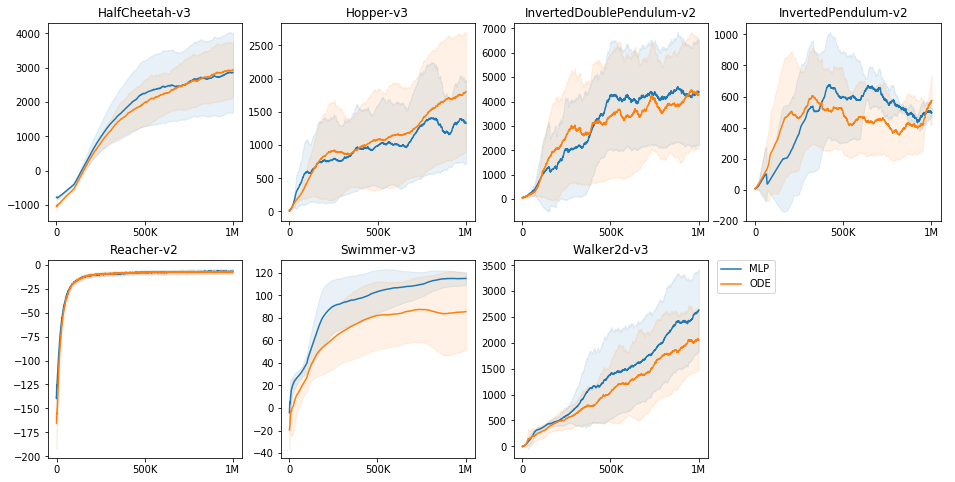

# Application of Neural Ordinary Differential Equations for Continuous Control Reinforcement Learning

This repository contains implementation of the adjoint method for
backpropagating through ODE solvers on top of Eager TensorFlow and
experiments with models containing ODE layers in MuJoCo and Roboschool
environments with policies training using PPO.


## Install and Run

Firstly, install TensorFlow version 1.13.1. Note that GPU version
may not be necessary as the models are quite simple and could run
fast on a powerful CPU. Cloning the repo and installing
the requirements:
```{bash}
git clone --recursive https://github.com/MichaelKonobeev/neuralode-rl.git
cd neuralode-rl
pip install -r requirements.txt
```
You will need to install environment dependencies for
[MuJoCo](https://github.com/openai/mujoco-py) and/or
[Roboschool](https://github.com/openai/roboschool) envs separately.

To run baseline MLP-model experiment on a single env:
```{bash}
python run-mujoco.py --env-id HalfCheetah-v3 --logdir logdir/mlp/half-cheetah.00
# OR
python run-roboschool.py --env-id RoboschoolHumanoidFlagrun-v1 \
     --logdir logdir/mlp/roboschool-humanoid-flagrun.00
```
To run experiments with models containing ode-layers for both
policy and value function:
```{bash}
python run-mujoco.py --env-id HalfCheetah-v3 \
    --logdir logdir/ode/half-cheetah.00 --ode-policy --ode-value
# OR
python run-roboschool.py --env-id RoboschoolHumanoidFlagrun-v1 \
    --logdir logdir/ode/roboschool-humanoid-flagrun.00
```

You can also schedule all of the experiments using `task-spooler`
which could be install on Ubuntu with `sudo apt-get install task-spooler`.
After that launching `run.py` should work:
```{bash}
python run.py --logdir-prefix logdir/mlp/
python run.py --logdir-prefix logdir/ode/ --ode-policy --ode-value
```
With the same script it is possible to run only a subset of environments, e.g.
by specifying `--env-ids roboschool` or `--env-ids mujoco` or (possibly in
addition) one or several env ids.

This will schedule 5 runs with different seeds for each MuJoCo env,
and 3 runs with different seeds for each Roboschool env. You can
set the number of tasks that could run concurrently to e.g. 5
using the following command:
```{bash}
tsp -S 5
```
Additionally, to watch the task queue you may run
```{bash}
watch -n 2 zsh -c "tsp | tr -s ' ' | cut -d ' ' -f 1,2,4,8-"
```

## Results

### MuJoCo


### Roboschool


The plots show average reward over last 100 episodes during training.
For MuJoCo envs the error bars represent standard deviation from
the mean shown by a bold line. For Roboschool experiments each
line of the same color corresponds to a run with a different seed.

## References
* [torchdiffeq](https://github.com/rtqichen/torchdiffeq): author's implementation of the adjoint method and their experiments
with neural ODES
* [neural-ode](https://github.com/saparina/neural-ode): implementation of the adjoint method on top of Eager TensorFlow
and experiments with neural ODEs for image and text sentiment classification.

## Citation

Please cite this repository if it was useful for your research
```
@misc{konobeev2018,
  author={Mikhail Konobeev},
  title={Neural Ordinary Differential Equations for Continuous Control},
  year={2019},
  publisher={GitHub},
  journal={GitHub repository},
  howpublished={\url{https://github.com/MichaelKonobeev/neuralode-rl}},
}
```
